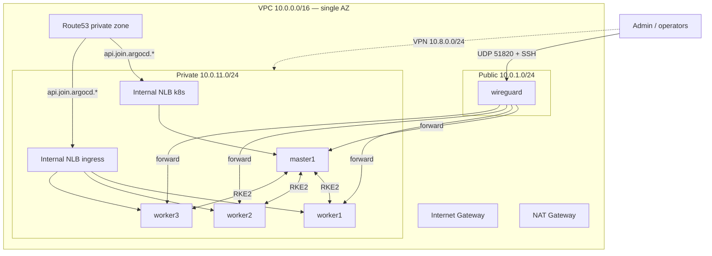

# LLA-RKE2-CS2 — Architecture

Client: **LLA** | Nonprod as prod | WireGuard-only access, internal NLB, Route53, **Prometheus/Grafana**, **AWS Secrets Manager** (no backups).

Reference lab (patterns only): [AWSK8S-RKE2-CS1](../../AWSK8S-RKE2-CS1) — LLA does **not** use CS1’s external NGINX LB or bastion.

---

## Infrastructure overview

| Node / service | Role |
|----------------|------|
| wireguard | **Only** public entry — VPN + SSH for bootstrap |
| Internal NLB `k8s` | API `:6443`, join `:9345` → master1 |
| Internal NLB `ingress` | HTTP/HTTPS → Traefik NodePorts |
| Route53 private zone | `api`, `join`, `ingress`, `argocd`, `*.lla.internal` |
| master1 | RKE2 server (private) |
| worker1–3 | RKE2 agents + Traefik (private) |
| Argo CD | GitOps via Traefik |
| Prometheus / Grafana | `monitoring` namespace |

**5 EC2 instances** (no bastion). **[PRODUCTION.md](PRODUCTION.md)** · **[DNS-AND-LOAD-BALANCERS.md](DNS-AND-LOAD-BALANCERS.md)**

---

## Security groups

| Group | Ingress | Attached to |
|-------|---------|-------------|
| wireguard-sg | SSH 22; UDP 51820 | wireguard |
| master-sg | API 6443/9345, SSH, metrics; NLB from VPC | master1 |
| worker-sg | Traefik NodePorts, SSH, metrics; NLB from VPC | workers |

---

## Access model (WireGuard only)

1. SSH to **wireguard** public IP → run `playbook-wireguard.yml`
2. Configure **WireGuard client** on laptop (`DNS = 10.0.0.2`)
3. Connect VPN → SSH/Ansible **directly** to private IPs (no ProxyJump)
4. `kubectl` / Argo CD / apps via Route53 private names

---

## Deployment order

1. `terraform apply` — VPC, IAM, Secrets Manager, EC2, NLBs, Route53
2. `./scripts/sync-ansible-vars.sh` + `inventory.ini`
3. `ansible-playbook site.yml` (WireGuard only)
4. **Connect VPN** → RKE2 playbooks → Traefik → External Secrets → Prometheus/Grafana → Argo CD

---

## Ingress & GitOps

| Component | Technology |
|-----------|------------|
| Ingress | **Traefik** — [TRAEFIK.md](TRAEFIK.md) |
| GitOps | **Argo CD** — [ARGOCD.md](ARGOCD.md) |

---

## Explicit non-goals

- Bastion / SSH jump host
- Multi-AZ subnets
- RDS
- External NGINX LB EC2 (CS1)
- NGINX Ingress Controller
